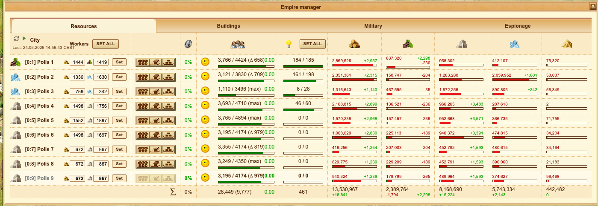
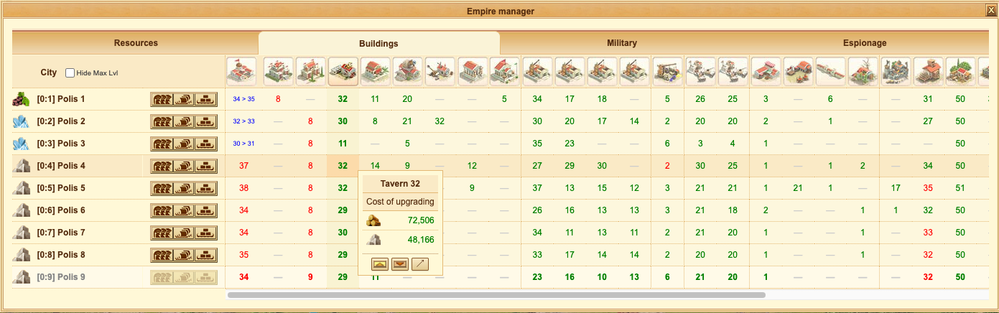
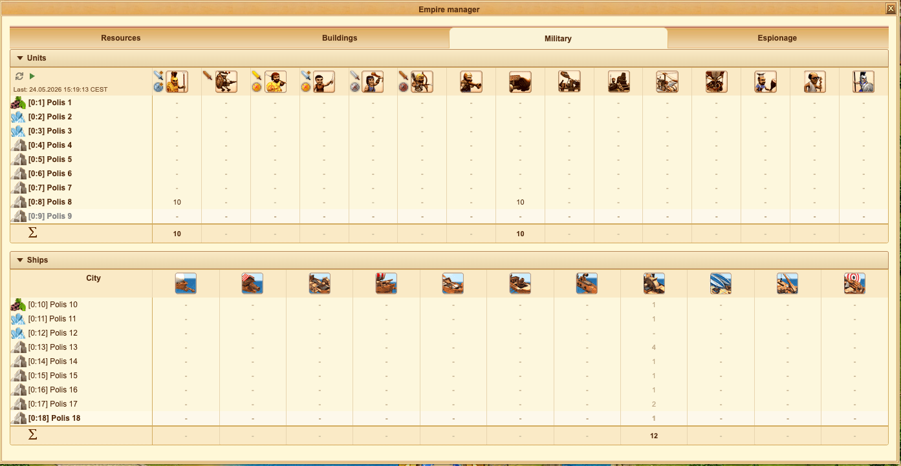
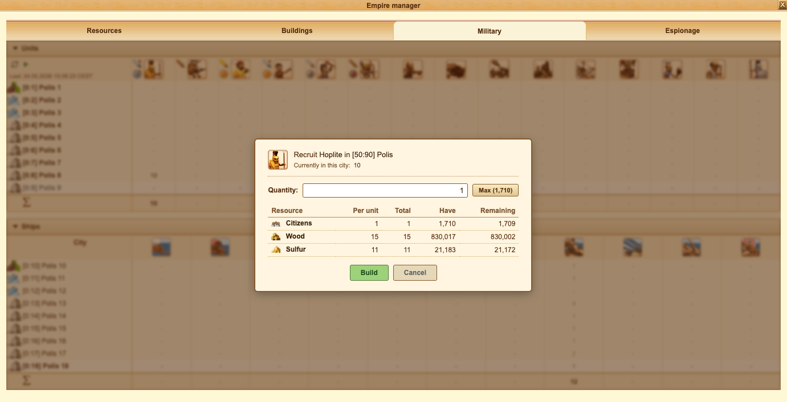
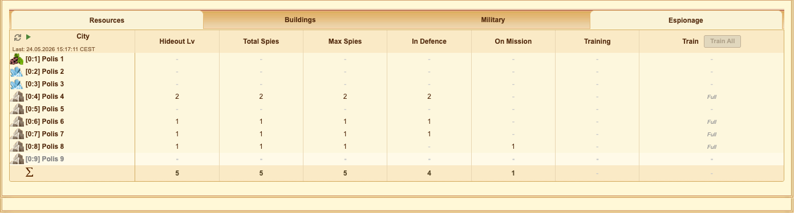

<p align="center">
  
</p>

<h1 align="center">IkaX — Ikariam Enhanced</h1>

<p align="center">
  A free, open-source Chrome extension that significantly improves the interface of <a href="https://ikariam.gameforge.com">Ikariam</a>.<br/>
  Forked from <a href="https://chromewebstore.google.com/detail/ikaeasy-v3/ajadldpgpliefphimkcmoggeidkilpod">IkaEasy V3</a> with continued development and new features.
</p>

<p align="center">
  <a href="https://www.buymeacoffee.com/ikax"></a>
  <a href="https://github.com/lyquyduong/ikaX/issues"></a>
</p>

---

## Screenshots

### Empire Manager — Resources
Manage all resources, production, expenses, and workers across every city in one dashboard.



### Empire Manager — Buildings
View and upgrade building levels across all cities. One-click upgrade with cost preview.



### Empire Manager — Military
Monitor army units and ships across all cities. Recruit directly from the dashboard.



### Empire Manager — Recruit Units
Recruit units with full cost breakdown — per-unit cost, total, current stock, and remaining resources.



### Empire Manager — Espionage
Track hideout levels, spy counts, and training status. Bulk-train spies across all cities.



---

## Features

### Empire Manager
A comprehensive cross-city management dashboard with four tabs:
- **Resources** — stocks, production rates, expenses, wine countdown, bulk worker controls, auto-refresh
- **Buildings** — building level grid, one-click upgrade/demolish, hide maxed buildings
- **Espionage** — hideout levels, spy counts, bulk Train All, auto-refresh
- **Military** — army/ship grid, recruit from dashboard, build queue tracking, auto-refresh

### Building Queue
Queue building upgrades across cities. Automatic construction start with cross-city switching and snooze countdown.

### City View
Building level badges, resource production rates, gold income summary, wine depletion timer, quick city switch, keyboard hotkeys (0–9, -, =), colony demolition safety lock.

### Island View
Action Points, ship ownership, wood/mine/wonder levels, alliance & player color markers.

### World Map & Island Search
Search and filter islands by resource type, wonder, and occupancy (empty/full).

### Alliance & Player Marking
Assign colors to alliances and players. Persistent across page reloads.

### Military Advisor
Fleet composition in troop movements, combat report saving to ikalogs.ru, round-by-round analysis.

### Diplomacy
Clickable links in messages, image auto-embed, alliance member list tab, clearer tab labels.

### Transport & Trade
Quick-load resource buttons (±500, +1000, +2000, +5000), All/Half/Nothing unit load buttons.

### Desktop Notifications
Building complete, recruitment done, transport loaded/arrived/returned, advisor alerts. All configurable.

### Notes
Personal notes stored locally per server. Create, edit, delete without leaving the game.

### Quality of Life
Hide Premium/ads/Happy Hour/friends bar, auto-accept daily bonus, quick menu, toolbar popup with gold & resource overview.

---

## What's New (vs IkaEasy V3)

- **Manifest V3** — fully migrated to Chrome's latest extension platform
- **Espionage tab** — monitor spies, bulk train across all cities
- **Military tab** — view units/ships, recruit from dashboard, build queue tracking
- **Bulk workers** — set production or scientists across all cities in one click
- **Auto-refresh** — configurable intervals for Resources, Espionage, and Military tabs
- **Toolbar popup** — gold overview and empire resources at a glance
- **Colony safety lock** — prevent accidental demolition of non-mobile colonies
- **GitHub support** — bug reports and feature requests via Issues
- **Buy Me a Coffee** — simplified donation support

---

## Installation

### From Chrome Web Store
[Chrome extension store](https://chromewebstore.google.com/detail/ikax/jfblgehbndjaknhlklaphndpndefmnnh)

### Manual (Developer Mode)
1. Clone or download this repository
2. Open `chrome://extensions/` in Chrome
3. Enable **Developer mode** (top right)
4. Click **Load unpacked** and select the repository root folder
5. Open any [Ikariam](https://lobby.ikariam.gameforge.com/) game world

---

## Build for Chrome Web Store

```bash
npm install
./build.sh            # uses version from manifest.json
./build.sh 4.1.0      # custom version number
```

Output: `dist/ikax-<version>.zip` ready to upload.

---

## Support

- **Bug reports:** [GitHub Issues](https://github.com/lyquyduong/ikaX/issues/new?labels=bug&template=bug_report.md)
- **Feature requests:** [GitHub Issues](https://github.com/lyquyduong/ikaX/issues/new?labels=enhancement&template=feature_request.md)
- **Donate:** [Buy Me a Coffee](https://www.buymeacoffee.com/ikax)

---

## Detailed Feature List

For a complete feature-by-feature breakdown in English, Vietnamese, and Chinese, see [FEATURES.md](FEATURES.md).

---

## License

This project is open-source. Contributions are welcome!
